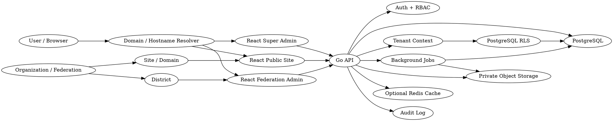
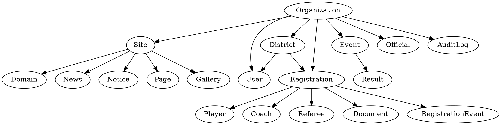

# Federation Sports Platform — Product & Engineering Specification

> Status: Architecture / Implementation Blueprint
> Target repository: Geltrax69/Fedration_Sports
> Primary goal: One production platform serving multiple federation and district websites from one application/server and one PostgreSQL database, with strict tenant isolation.

## 1. Executive Summary

This project is a multi-tenant sports federation platform.

The platform will host multiple federation and district websites on different domains while sharing:

- one React frontend codebase
- one Golang backend
- one PostgreSQL database
- one private object-storage layer for documents/media
- one authentication/authorization system
- one shared design system
- multiple configurable themes/homepage designs

The system must prevent data mixing between federations, districts, users, caches, search results, background jobs, files, analytics, and APIs.

The platform is intended to replace the need for separately deployed federation websites. A new federation should normally be onboarded by configuration rather than by forking the application.

## 2. Existing Source Repositories

### 2.1 IND-SepakTraw

Repository: https://github.com/Geltrax69/IND-SepakTraw

Relevant characteristics observed in the repository:

- React + Vite
- React Router
- MUI / Emotion
- Lucide icons
- Existing federation-oriented public website structure
- Existing information architecture and content requirements
- Existing visual patterns for federation pages

The repository's `requirments.md` describes:

- Home
- News
- Notices
- Results
- Rules and regulations
- Events
- MYAS compliance
- Anti-doping
- RTI
- Elections
- History
- Contact
- Document/PDF-heavy publishing

Treat this repository as the public-site visual/reference source.

### 2.2 sports_with_hsta

Repository: https://github.com/Geltrax69/sports_with_hsta

Relevant characteristics observed in the repository:

- React 19
- TypeScript
- Vite
- MUI
- Motion
- Tailwind tooling
- date-picker tooling
- image/export utilities
- newer frontend foundations

Treat this repository as the management/admin UI and interaction reference.

### 2.3 Reuse principle

Do not blindly merge both repositories.

Instead:

1. Identify reusable components, layouts, styling rules, utilities, and interaction patterns.
2. Move reusable pieces into shared packages/components.
3. Remove duplicate implementations.
4. Replace hard-coded federation-specific content with tenant-aware configuration.
5. Keep the new application as the single source of truth.

The target architecture is a refactor/combination of proven code, not a greenfield visual mockup that ignores the existing repositories.

## 3. Target Technology Stack

### Frontend

- React
- TypeScript
- Vite
- React Router
- MUI where existing components make sense
- Tailwind CSS where utility styling is beneficial
- Motion for deliberate micro-interactions
- Zod or equivalent runtime validation for frontend forms
- Responsive image handling
- Native lazy loading / intersection-based loading where appropriate

### Backend

- Go (Golang)
- HTTP API
- PostgreSQL driver
- Structured logging
- Context-aware request handling
- Middleware for authentication, tenant resolution, authorization, request IDs, rate limits, and observability

Suggested Go packages may include:

- chi or gin for routing
- pgx for PostgreSQL
- sqlc or a carefully controlled repository/data-access layer
- validator or explicit validation
- zap / zerolog for structured logs

Choose one consistent approach rather than mixing multiple overlapping frameworks.

### Database

- PostgreSQL
- PostgreSQL Row Level Security (RLS)
- Foreign-key constraints
- Unique constraints scoped by tenant/organization
- Transactions for multi-record workflows
- Migrations committed to source control
- Indexed tenant keys
- Query plans reviewed for high-volume queries

### Storage

Private object storage for:

- Aadhaar documents
- Passport copies
- Registration certificates
- Player photos where privacy requires it
- Certificates
- Federation documents
- Event media
- Public images

Sensitive objects should not be placed in a public web directory.

### Caching

Optional Redis/cache layer only where necessary.

Cache keys MUST include tenant/site identity.

Example:

`site:{organization_id}:{site_id}:homepage`

Never use a global `homepage` cache key for tenant data.

### Deployment

One shared production backend serving multiple domains.

Conceptually:

```
Cloud / VM / Container
        |
        +-- React static assets / CDN
        +-- Go API
        +-- PostgreSQL
        +-- Private Object Storage
        +-- Optional Redis
```

## 4. Multi-Tenant Model

The platform is organized as:

```
Platform
  |
  +-- Federation / Organization
        |
        +-- Site
        |     |
        |     +-- Domain(s)
        |     +-- Theme
        |     +-- CMS content
        |
        +-- Districts
        |
        +-- Users
        |
        +-- Players
        +-- Coaches
        +-- Referees
        +-- Registrations
        +-- Events
        +-- Results
        +-- Documents
        +-- News
        +-- Notices
        +-- Gallery
        +-- Compliance
        +-- Audit logs
```

A district is not the same thing as a federation tenant.

A federation can own many district associations. A district administrator may have a narrower authorization scope inside the federation.

## 5. Domain / Tenant Resolution

Incoming request:

```
GET /news
Host: rohtak.example.in
```

Resolution:

```
HTTP Host
   |
   v
Domain lookup
   |
   v
Site
   |
   v
Organization / Federation
   |
   v
District scope (when relevant)
   |
   v
Request context
```

Tenant identity should be derived server-side.

Do NOT trust:

- query-string federation IDs
- query-string district IDs
- hidden form fields
- client-controlled tenant headers
- React state as a security boundary

The browser can request data, but the backend decides what tenant the request belongs to.

## 6. Tenant Isolation Rules

Every tenant-owned database record must carry the minimum required ownership scope.

Typical fields:

```
organization_id
site_id
district_id
created_by
updated_by
```

Not every table necessarily needs every field, but ownership must be explicit.

Mandatory controls:

1. Application-level tenant middleware.
2. Authorization checks.
3. PostgreSQL RLS for tenant-owned tables.
4. Foreign keys that prevent cross-tenant relationships.
5. Tenant-aware cache keys.
6. Tenant-aware search indexes/queries.
7. Tenant-aware background jobs.
8. Tenant-aware file access.
9. Tenant-aware analytics.
10. Automated cross-tenant integration tests.

## 7. PostgreSQL Row Level Security

The database should enforce tenant visibility.

Conceptual flow:

```
Authenticated request
        |
        v
Resolve organization_id
        |
        v
Set PostgreSQL transaction/request context
        |
        v
RLS policy
        |
        v
Only rows belonging to the permitted tenant are visible
```

RLS is a backstop, not a replacement for application authorization.

The application should still verify:

- role
- organization
- site
- district
- resource ownership
- operation permission

## 8. Core Roles

### Super Admin

Platform-wide operator.

Capabilities:

- create federation
- update federation
- suspend federation
- create district structures
- create federation admin accounts
- create district admin accounts
- configure domains
- select available themes
- manage platform-level configuration
- review audit logs
- platform monitoring

Super Admin is the only normal role with cross-federation visibility.

### Federation Admin

Scoped to one federation.

Capabilities:

- edit federation profile
- manage website
- manage theme
- publish news
- publish notices
- manage pages
- manage documents
- manage events
- manage results
- manage players
- manage coaches
- manage referees
- approve/reject registrations
- manage federation officials
- manage districts inside the federation
- manage compliance content

### District Admin

Scoped to one district/federation context.

Capabilities depend on configured permissions, but generally include:

- district website content
- district events
- district news
- district documents
- district registrations
- district athletes
- district coaches
- district referees

The district admin MUST NOT see unrelated districts.

### Member / Applicant

Capabilities:

- create registration
- save/update draft
- upload documents
- submit application
- check status
- update allowed profile fields
- access approved member content

## 9. Database Model

High-level model:

```
organizations
  |
  +-- sites
  |     +-- domains
  |     +-- site_settings
  |     +-- theme_config
  |
  +-- districts
  |
  +-- users
  |     +-- roles
  |
  +-- people
  |     +-- player_profiles
  |     +-- coach_profiles
  |     +-- referee_profiles
  |
  +-- registrations
  |     +-- registration_documents
  |     +-- registration_events
  |
  +-- competitions
  |     +-- event_documents
  |     +-- event_registrations
  |     +-- results
  |
  +-- news
  +-- notices
  +-- pages
  +-- documents
  +-- galleries
  +-- officials
  +-- compliance_items
  +-- audit_logs
```

### organizations

- id
- name
- short_name
- sport
- country
- state
- status
- contact_email
- phone
- address
- created_at
- updated_at

### sites

- id
- organization_id
- district_id nullable
- name
- theme_id
- status
- settings
- created_at
- updated_at

### domains

- id
- site_id
- hostname
- is_primary
- is_verified
- is_active

Unique rule:

```
UNIQUE(hostname)
```

### districts

- id
- organization_id
- name
- code
- status

A district must belong to exactly one organization.

### users

- id
- organization_id nullable for Super Admin
- district_id nullable
- email
- password_hash
- status
- last_login_at
- created_at

Email identity rules should be explicitly modeled. Avoid ambiguous accounts that could accidentally acquire the wrong federation scope.

### roles / user_roles

Use explicit role assignments rather than booleans such as `is_admin`.

## 10. Registration Domain

One registration engine supports:

```
PLAYER
COACH
REFEREE
```

Shared fields:

- full legal name
- father's name
- mother's name
- phone
- email
- gender
- category
- district association
- date of birth
- profile photo
- identity documents

Specialized profile tables hold role-specific fields.

## 11. Registration Workflow

Internal state machine:

```
DRAFT
  |
  v
SUBMITTED
  |
  v
UNDER_REVIEW
  |
  +---> CHANGES_REQUESTED
  |          |
  |          v
  |      UNDER_REVIEW
  |
  +---> APPROVED
  |
  +---> REJECTED
  |
  +---> SUSPENDED
```

Public UI may show:

```
Pending Approval
```

immediately after successful submission.

Every transition records:

- actor
- timestamp
- previous status
- next status
- optional note
- request metadata where appropriate

## 12. Player Registration Fields

### Personal information

- Full Legal Name *
- Father's Name
- Mother's Name
- Phone Number
- Gender *
- Category *
- Email Address
- Password
- District Association *
- Date of Birth *

### Identification

- Aadhaar Number *
- Aadhaar document

### Passport (optional)

- passport number
- passport expiry
- passport issued place
- passport copy

### Kit / performance

- T-shirt size
- Tracksuit size
- Shoes size
- Pant size
- District games played
- State-level games played
- National games played
- International games played

### Certificates

- up to 10 certificate files
- JPG/PNG
- maximum 5MB per image

All limits must be enforced server-side.

## 13. File Security

Sensitive documents:

- MUST NOT live in a public uploads directory.
- MUST be private.
- MUST require authorization before retrieval.
- SHOULD use short-lived signed URLs.
- SHOULD have MIME/file-signature validation.
- SHOULD have malware scanning.
- SHOULD log access.
- SHOULD support retention policies.

Aadhaar number display should be masked in normal administrative UI.

Example:

```
XXXX XXXX 4821
```

## 14. Public Website CMS

Each site can manage:

- homepage
- pages
- navigation
- footer
- news
- notices
- circulars
- events
- results
- officials
- documents
- gallery
- compliance
- anti-doping
- RTI
- elections
- contact details

The CMS must store content independently from visual theme configuration.

## 15. Homepage Theme System

The platform should support multiple homepage designs without duplicating data.

Example themes:

1. Royal Editorial
2. Federation Classic
3. Athletic Modern
4. Championship
5. Institutional / Official

Concept:

```
Content data
     |
     +---- Theme A renderer
     +---- Theme B renderer
     +---- Theme C renderer
     +---- Theme D renderer
```

The federation admin selects a theme.

No database duplication occurs.

## 16. Design System

The public site visual language should combine:

- high-contrast editorial typography
- royal/institutional display type
- clean sans-serif UI typography
- large photography
- restrained motion
- premium spacing
- strong content hierarchy
- responsive layouts
- accessible contrast and focus states

Recommended direction:

- Display: Cormorant Garamond / DM Serif Display / Playfair Display, final choice after design pass
- Interface: Inter / Manrope / Plus Jakarta Sans

Use one primary display family and one primary interface family consistently.

## 17. Design Quality Workflow

For every major public page:

1. Build from reusable components.
2. Apply the shared design system.
3. Run the Taste skill/design workflow in the development environment.
4. Run /polish.
5. Run /clarify.
6. Review responsive behavior.
7. Review accessibility states.
8. Remove unnecessary visual complexity.
9. Verify loading performance.

Micro-interactions should reinforce state and hierarchy. Do not animate everything.

## 18. Spectrum UI / Component Usage

The requested Spectrum UI MCP configuration is:

```json
{
  "mcpServers": {
    "spectrum-ui": {
      "command": "npx",
      "args": ["-y", "@spectrumui/mcp"]
    }
  }
}
```

Use it in the development environment when available to discover/reuse suitable interface patterns and components.

The final application should still maintain a coherent local design system; external component discovery must not create inconsistent UX.

## 19. Performance: Primary Goal

The public websites should load quickly even when a federation has:

- large hero images
- many news items
- PDF documents
- multiple galleries
- event posters
- rich homepage modules

Performance is a system concern, not just a frontend concern.

## 20. Performance Architecture

Recommended request path:

```
Browser
   |
   v
CDN / Edge
   |
   +--> Static JS/CSS/images
   |
   +--> Go API
          |
          v
      PostgreSQL
          |
          +--> storage metadata
```

Do not force the browser to download the whole application before it can display the public homepage.

## 21. React Performance Rules

### Code splitting

Route-level lazy loading for:

- Home
- News
- Events
- Results
- Registration
- Admin
- Super Admin

Admin and Super Admin code should not ship in the public site's initial bundle.

### Avoid unnecessary re-renders

Use:

- stable component boundaries
- memoization only when profiling justifies it
- normalized state for complex admin views
- pagination
- virtualization for large tables

## 22. Image Optimization

Large images are one of the most likely causes of slow federation websites.

Use:

- responsive image sizes
- WebP/AVIF where supported
- correct intrinsic dimensions
- lazy loading below the fold
- eager loading only for the primary LCP image
- CDN/image transformation when available

Do not upload one multi-megabyte source and use that same file everywhere.

Generate derivatives such as:

```
320w
640w
960w
1280w
1920w
```

depending on use.

## 23. Largest Contentful Paint

The homepage hero/LCP image should:

- have a predictable aspect ratio
- be preloaded/eager where appropriate
- be served in an optimized format
- avoid JavaScript-dependent rendering where possible
- avoid layout shifts

The hero should not wait for unrelated admin code, registration code, gallery scripts, analytics, or third-party widgets.

## 24. Fonts

Avoid loading unnecessary font weights.

Prefer variable fonts when they reduce total payload.

Use font-display behavior appropriate for perceived performance.

## 25. API Performance

Avoid homepage waterfalls such as:

```
GET /site
GET /navigation
GET /hero
GET /news
GET /events
GET /results
GET /officials
GET /gallery
```

Instead expose a purpose-built aggregate endpoint:

```
GET /api/public/home
```

returning the exact data needed for first render.

Example:

```json
{
  "site": {},
  "theme": {},
  "navigation": [],
  "hero": {},
  "featuredNews": [],
  "upcomingEvents": [],
  "latestResults": [],
  "stats": {},
  "featuredOfficials": []
}
```

Secondary/paginated sections can load later.

## 26. Go Backend Performance

Go should handle:

- concurrent requests
- lightweight middleware
- database connection pooling
- efficient JSON responses
- request cancellation via context
- bounded concurrency for background work

Avoid:

- N+1 queries
- unbounded goroutines
- global mutable request state
- fetching entire tables and filtering in Go
- huge JSON responses

Select only the required columns.

## 27. PostgreSQL Performance

Required practices:

- indexes for tenant key + common filters
- compound indexes matching real query patterns
- foreign-key indexes
- cursor/page pagination as appropriate
- EXPLAIN ANALYZE on expensive queries
- connection pooling
- reasonable transaction sizes
- avoid SELECT * in hot paths

Examples:

```
INDEX players(organization_id, district_id, status)
INDEX registrations(organization_id, status, created_at)
INDEX news(site_id, published_at DESC)
INDEX events(organization_id, start_date)
```

Indexes must be based on actual query patterns.

## 28. Caching Rules

Public, relatively stable data can be cached:

- site settings
- theme configuration
- navigation
- published pages
- public news
- upcoming events
- published document metadata

Cache key example:

```
site:{site_id}:homepage:v1
```

Incorrect:

```
homepage
news
events
documents
```

Never cache authorization-sensitive data without an explicit user/tenant strategy.

## 29. Static Delivery

Use immutable hashed frontend assets:

```
app.4c8f2.js
app.19fd8.css
hero.7ad91.webp
```

Long cache lifetimes are then safe for immutable assets.

HTML/API responses can use shorter revalidation periods.

## 30. Public vs Admin Bundles

The application should be logically split into:

```
public-site
admin
super-admin
```

Public visitors should never have to download:

- admin charts
- registration management
- document moderation
- user management
- Super Admin screens

This reduces initial JavaScript payload.

## 31. SEO

Public federation sites should support:

- crawl-friendly HTML strategy
- canonical URLs
- title/meta descriptions
- Open Graph metadata
- structured metadata where applicable
- sitemap
- robots.txt
- semantic headings
- stable slugs

If Vite SPA-only rendering proves insufficient for required SEO/performance goals, introduce SSR/prerendering for the public site while keeping admin client-rendered.

## 32. Registration UX

Use a multi-step form:

```
Step 1 — Personal
Step 2 — Identification
Step 3 — Passport / Optional
Step 4 — Kit / Performance
Step 5 — Certificates
Step 6 — Review
Step 7 — Submit
```

Provide:

- draft autosave
- upload progress
- field-level validation
- clear errors
- review screen
- application number
- status page

Uploads should be retryable and resumable where practical.

## 33. CMS Publishing Workflow

Content lifecycle:

```
DRAFT
  |
  v
PREVIEW
  |
  v
PUBLISHED
  |
  v
ARCHIVED
```

Important federation documents should preserve:

- who published
- when published
- version
- replacement history

## 34. Audit System

Audit sensitive administrative actions.

Example:

```
audit_logs

id
organization_id
actor_id
action
entity_type
entity_id
old_value
new_value
request_id
created_at
```

Examples:

- registration approved
- registration rejected
- admin created
- domain changed
- document accessed
- content published
- user suspended
- theme changed

## 35. API Design

### Public

```
GET /api/public/site
GET /api/public/home
GET /api/public/news
GET /api/public/notices
GET /api/public/events
GET /api/public/results
GET /api/public/documents
GET /api/public/pages/:slug
```

### Registration

```
POST /api/registrations
GET  /api/registrations/:id
PATCH /api/registrations/:id
POST /api/registrations/:id/submit
POST /api/registrations/:id/documents
```

### Admin

```
GET /api/admin/dashboard
GET /api/admin/registrations
POST /api/admin/registrations/:id/approve
POST /api/admin/registrations/:id/reject
GET /api/admin/players
GET /api/admin/coaches
GET /api/admin/referees
GET /api/admin/events
GET /api/admin/news
GET /api/admin/documents
PATCH /api/admin/site
```

### Super Admin

```
GET /api/super-admin/organizations
POST /api/super-admin/organizations
PATCH /api/super-admin/organizations/:id

GET /api/super-admin/sites
POST /api/super-admin/sites

GET /api/super-admin/domains
POST /api/super-admin/domains

POST /api/super-admin/admins
```

All routes must perform server-side authorization.

## 36. API Security

Required:

- HTTPS
- authentication
- authorization
- request validation
- rate limiting
- CSRF protection where cookie authentication requires it
- secure password hashing
- security headers
- request IDs
- structured audit logging
- file upload limits
- payload size limits
- timeout handling

Password hashing should use a modern memory-hard password hashing function such as Argon2id.

## 37. Background Jobs

Use asynchronous jobs for:

- email notifications
- image resizing
- document processing
- PDF previews
- malware scanning
- certificate/ID generation
- scheduled publishing
- cleanup/retention
- report exports

Every background job must carry tenant context.

Example:

```
job
{
  organization_id,
  site_id,
  entity_id,
  job_type
}
```

A worker must not perform a tenant-sensitive operation without this context.

## 38. Error Isolation

Errors should never expose:

- another tenant's IDs
- SQL queries
- storage paths
- secrets
- internal authorization details

Use consistent API error shapes.

Example:

```json
{
  "error": {
    "code": "REGISTRATION_NOT_FOUND",
    "message": "Registration was not found."
  }
}
```

## 39. Search

Start with PostgreSQL search for simplicity.

Every query must include tenant/site scope.

Never implement search by retrieving every federation record and filtering in React.

## 40. Analytics

Analytics data should also be tenant-scoped.

Example:

```
page_views
organization_id
site_id
path
timestamp
```

A dashboard for Federation A cannot aggregate Federation B's traffic.

## 41. Domain Onboarding

Super Admin flow:

```
Create Federation
    |
    v
Create Site
    |
    v
Select Theme
    |
    v
Assign Domain
    |
    v
Verify DNS / TLS
    |
    v
Create Federation Admin
    |
    v
Publish
```

A new federation should be onboarded without another repository.

## 42. Data Lifecycle

For each major entity define:

- creation
- editing
- submission
- approval
- publication
- archival
- deletion/retention

Do not allow destructive deletion of records required for audit history.

Prefer soft-delete or archival where appropriate.

## 43. Disaster Recovery

Production PostgreSQL should have:

- automated backups
- point-in-time recovery where infrastructure supports it
- tested restore procedure
- backup retention policy
- separate backup storage
- migration/version tracking

A backup is not considered reliable until restoration is tested.

## 44. Observability

The Go server should expose:

- request latency
- status codes
- error rate
- database latency
- pool usage
- cache hit/miss where used
- upload failures
- background job failures

Use a request ID:

```
request -> middleware -> logs -> database/job/audit
```

## 45. Testing Strategy

### Unit tests

- tenant resolver
- authorization
- registration validation
- status transitions
- file validation
- ID generation

### Integration tests

- API + PostgreSQL
- RLS
- registration submission
- approval
- domain resolution
- CMS publishing

### Tenant isolation tests

Mandatory examples:

```
Federation A admin -> Federation A player       ALLOWED
Federation A admin -> Federation B player       FORBIDDEN

District A admin -> District A registrations    ALLOWED
District A admin -> District B registrations    FORBIDDEN

Federation A registration
 -> Federation B district                       FORBIDDEN

Site A cache
 -> Site B content                              ISOLATED
```

### Browser tests

Critical flows:

- public homepage
- registration
- document upload
- login
- admin approval
- CMS publishing
- theme switching

## 46. Performance Budgets

Set practical budgets and enforce them in CI.

Indicative public-homepage goals:

- minimal critical JS
- compressed assets
- optimized hero/LCP image
- no unnecessary third-party scripts
- fast server response
- no avoidable request waterfalls
- no layout shift from images/fonts

Exact numerical thresholds should be established after measuring the first implementation on representative mobile hardware and networks.

## 47. Accessibility

Public and admin interfaces should support:

- keyboard navigation
- visible focus
- semantic labels
- proper form errors
- accessible dialogs
- sufficient contrast
- reduced-motion preference
- screen-reader-compatible status messages
- accessible upload controls

Motion must respect `prefers-reduced-motion`.

## 48. What is currently reusable

### From IND-SepakTraw

- public federation navigation/content model
- React/Vite public-site foundation
- MUI component foundation
- React Router patterns
- federation page content concepts

### From sports_with_hsta

- newer React/TypeScript foundation
- Motion interaction patterns
- management/admin UI patterns
- date handling utilities
- image/export utilities

The final platform should extract useful code into reusable shared modules instead of maintaining two independent applications.

## 49. What Remains to Be Built

### Platform foundation

- [ ] Monorepo/application structure
- [ ] Go API
- [ ] PostgreSQL database
- [ ] migrations
- [ ] tenant middleware
- [ ] RLS policies
- [ ] authentication
- [ ] role/permission system
- [ ] domain resolution
- [ ] object storage integration
- [ ] audit logging

### Super Admin

- [ ] federation creation
- [ ] federation edit/suspend
- [ ] district management
- [ ] admin creation
- [ ] domain management
- [ ] theme management
- [ ] platform dashboard
- [ ] audit viewer

### Public website

- [ ] multi-tenant homepage
- [ ] theme engine
- [ ] navigation CMS
- [ ] pages
- [ ] news
- [ ] notices
- [ ] events
- [ ] results
- [ ] documents
- [ ] gallery
- [ ] officials
- [ ] compliance
- [ ] RTI
- [ ] elections
- [ ] anti-doping
- [ ] history
- [ ] contact

### Registration

- [ ] player registration
- [ ] coach registration
- [ ] referee registration
- [ ] document upload
- [ ] draft/save
- [ ] submission
- [ ] approval
- [ ] rejection
- [ ] change requests
- [ ] member profile
- [ ] member ID generation

### Federation Admin

- [ ] dashboard
- [ ] registration queue
- [ ] players
- [ ] coaches
- [ ] referees
- [ ] districts
- [ ] events
- [ ] results
- [ ] website builder
- [ ] content publishing
- [ ] documents
- [ ] officials

### Performance/security

- [ ] route code splitting
- [ ] responsive images
- [ ] CDN/static caching
- [ ] API response caching where appropriate
- [ ] PostgreSQL query optimization
- [ ] tenant-aware cache keys
- [ ] rate limits
- [ ] upload security
- [ ] RLS test suite
- [ ] performance CI checks
- [ ] observability
- [ ] backup/restore validation

## 50. Graphviz Architecture Map

Use Graphviz to keep system relationships visible and update the diagram whenever major architecture changes occur.

Suggested file: `docs/architecture.dot`



## 51. Graphviz Data Relationship Map

Suggested file: `docs/data-model.dot`



## 52. GitHub Tracking Model

Recommended documentation:

```
README.md
docs/PLATFORM_SPECIFICATION.md
docs/ARCHITECTURE.md
docs/DATABASE.md
docs/TENANCY.md
docs/PERFORMANCE.md
docs/SECURITY.md
docs/REGISTRATION.md
docs/ROADMAP.md
docs/architecture.dot
docs/data-model.dot
```

After implementing a feature:

1. Update the relevant documentation.
2. Mark the roadmap task complete.
3. Update Graphviz diagrams if relationships changed.
4. Commit source and documentation together.
5. Record architectural decisions that affect future work.

## 53. Implementation Tracking Status

Use this status model:

- DONE — implemented and tested
- IN PROGRESS — actively being built
- BLOCKED — dependency or external decision required
- PLANNED — architecture exists, implementation not started
- DEFERRED — intentionally postponed

Never mark functionality DONE merely because a UI exists. DONE requires working backend/data flow and relevant tests.

## 54. Definition of Done

A feature is DONE only when:

- frontend exists
- Go API exists
- PostgreSQL schema/migration exists when needed
- authorization exists
- tenant isolation is verified
- validation exists
- errors are handled
- loading/empty states exist
- responsive UI works
- relevant audit entry exists when sensitive
- documentation is updated
- Graphviz is updated when architecture changed
- tests cover critical behavior
- GitHub commit exists

## 55. First Implementation Sequence

### Phase 1
Repository structure + Go API + PostgreSQL + migrations.

### Phase 2
Tenant/domain resolution + RLS + authentication + RBAC.

### Phase 3
Shared UI + public theme engine + public site migration from IND-SepakTraw.

### Phase 4
Admin shell and dashboard migration from sports_with_hsta patterns.

### Phase 5
Player/Coach/Referee registration and document system.

### Phase 6
CMS, events, results, documents, gallery, compliance.

### Phase 7
Super Admin onboarding/domain/theme management.

### Phase 8
Performance hardening, security review, tenant-isolation testing, observability, backups.

## 56. Non-Negotiable Architecture Rules

1. One production platform serves many domains.
2. Federation/district data is never trusted from the client.
3. Every tenant-sensitive query is scoped.
4. PostgreSQL RLS backs tenant isolation.
5. Sensitive files remain private.
6. Public and admin bundles are separated.
7. Public pages must not load unnecessary admin code.
8. Caches must include tenant/site identity.
9. Background jobs must carry tenant context.
10. Existing repository code should be reused where it is already correct.
11. New functionality must be documented in GitHub.
12. Graphviz must reflect current system relationships.
13. A UI-only implementation is not considered complete.
14. Security and tenant isolation take precedence over convenience.
15. Performance is measured, not assumed.

## 57. Current Project State

At the start of this specification, the target repository `Fedration_Sports` exists but is empty.

Therefore:

- Architecture: PLANNED
- Database: PLANNED
- Go backend: PLANNED
- React application: PLANNED
- Tenant isolation: PLANNED
- Public themes: PLANNED
- Admin: PLANNED
- Super Admin: PLANNED
- Registration system: PLANNED
- Graphviz documentation: PLANNED

The two source repositories are the implementation references from which reusable code and UI patterns should be extracted.

## 58. Final Product Definition

The finished platform should allow the platform owner to:

- create a federation
- create sites and districts
- connect domains
- create federation/district administrators
- select a public theme
- publish public content
- accept player/coach/referee registrations
- approve registrations
- operate competitions and results
- manage documents and compliance
- safely run all tenants on one server/database

The product is therefore a multi-tenant sports federation operating platform with a configurable public website, registration system, federation administration, district administration, and platform-level Super Admin.

The core stack is:

```
React
+
Golang
+
PostgreSQL
+
Strict tenant isolation
+
Reusable existing code
+
Theme-driven public websites
+
Performance-first delivery
```
